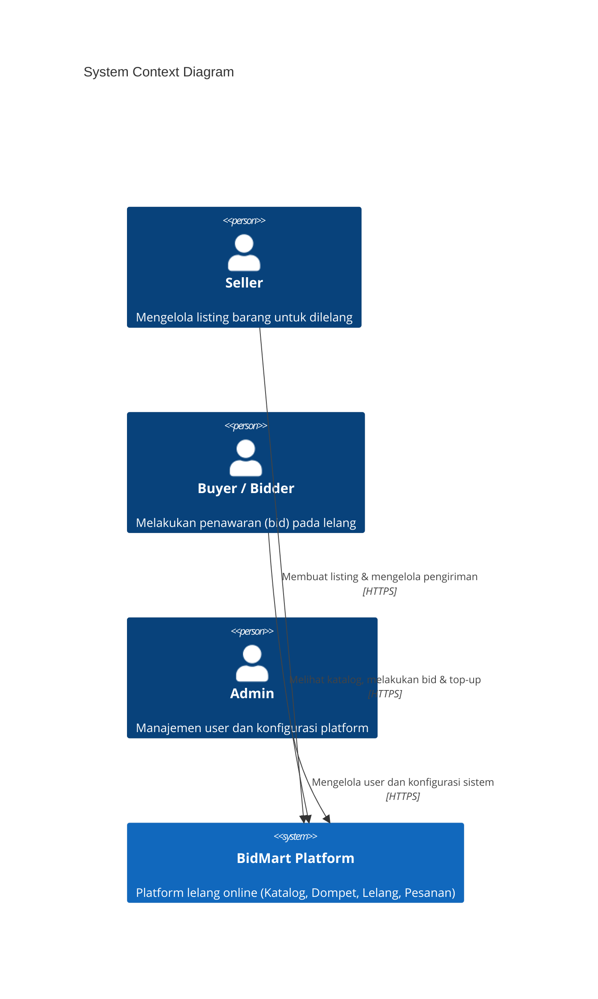
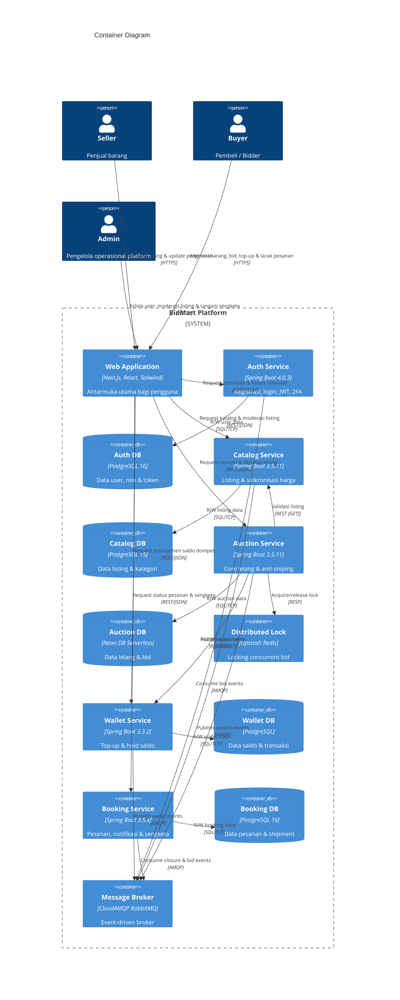
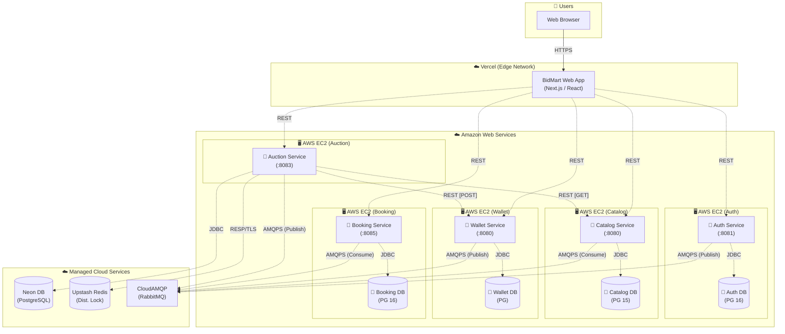
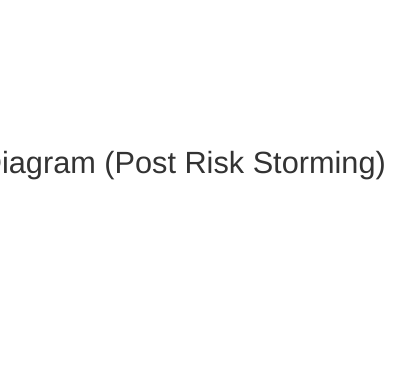

# Tutorial 9B: Visualizing Architecture & Architectural Risk

## Daftar Isi

- [Current Architecture (Commit 1)](#current-architecture)
  - [System Context Diagram](#system-context-diagram)
  - [Container Diagram](#container-diagram)
  - [Deployment Diagram](#deployment-diagram)
- [Future Architecture (Commit 2)](#future-architecture)
- [Risk Storming Explanation (Commit 3)](#risk-storming-explanation)
- [Individual Works (Commit 4)](#individual-works)

## Current Architecture

BidMart adalah platform lelang online berbasis *microservices* yang memungkinkan pengguna untuk menjual dan membeli barang melalui mekanisme lelang. Sistem terdiri dari 5 *microservice* utama yang saling berkomunikasi secara *synchronous* (REST) maupun *asynchronous* (RabbitMQ/AMQP).

### System Context Diagram

Diagram ini menunjukkan gambaran paling abstrak dari sistem BidMart, bagaimana sistem berinteraksi dengan pengguna dan sistem eksternal, tanpa menunjukkan detail teknis internal.

### Container Diagram

Diagram ini menunjukkan seluruh *container* (unit yang dapat dijalankan secara independen) yang menyusun sistem BidMart dan bagaimana mereka berkomunikasi satu sama lain. Pengguna berinteraksi melalui *Frontend Web Application*.

*Catatan: Garis panah dengan label [REST] atau [HTTPS] menandakan komunikasi synchronous, sedangkan [AMQP] menandakan komunikasi asynchronous.*

### Deployment Diagram

Diagram ini menunjukkan di mana dan bagaimana setiap *container* di-*deploy* pada infrastruktur produksi. *Frontend* berjalan secara *serverless* di Vercel, *service* aplikasi berjalan sebagai Docker container di AWS EC2, dan infrastruktur pendukung menggunakan *managed cloud services*.

## Future Architecture

*[Tambahkan diagram]*

### Arsitektur Masa Depan BidMart

*[Tambahkan deskripsi singkat perubahan arsitektur yang dilakukan]*

**Perubahan dari Current ke Future Architecture:**

| Area | Current | Future | Alasan |
|---|---|---|---|
| *[Isi setelah risk storming]* | | | |

## Risk Storming Explanation

### 1. Identification

*[Jelaskan risiko apa saja yang diidentifikasi tiap anggota secara individual, area mana saja yang dinilai berisiko, dan skor risiko masing-masing menggunakan Risk Matrix (Impact × Likelihood = Score).]*

| Area Risiko | Deskripsi Risiko | Impact (1-3) | Likelihood (1-3) | Skor | Level |
|---|---|---|---|---|---|
| *[Tambahkan temuan masing-masing anggota]* | | | | | |

### 2. Consensus

*[Jelaskan bagaimana proses diskusi berjalan, perbedaan pendapat yang muncul antar anggota, dan bagaimana tim mencapai kesepakatan akhir mengenai level risiko tiap area.]*

### 3. Mitigation

*[Jelaskan solusi mitigasi yang dipilih untuk setiap risiko yang disepakati, mengapa solusi tersebut dipilih, dan hubungkan dengan perubahan arsitektur di Commit 2.]*

| Risiko | Solusi Mitigasi | Perubahan Arsitektur |
|---|---|---|
| *[Isi setelah diskusi]* | | |

## Individual Works

### Individual Work [Nama] ([NPM])

*[Menambahkan **Component Diagram** dan **Code Diagram** dari container yang dikerjakan.]*
