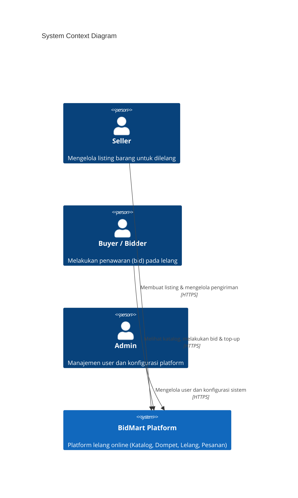
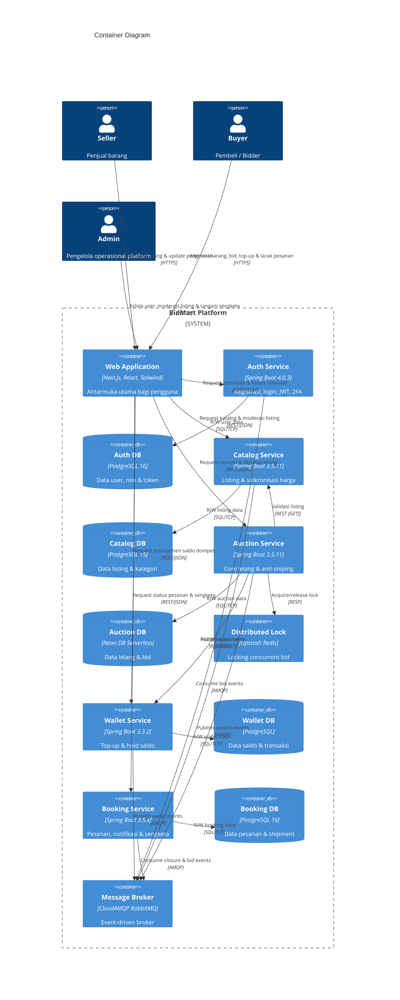
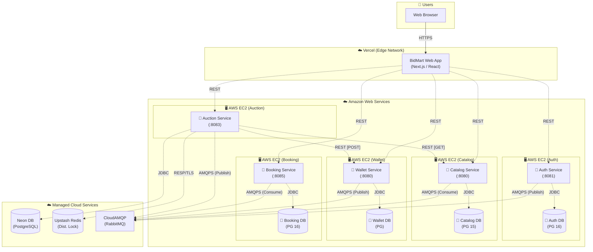
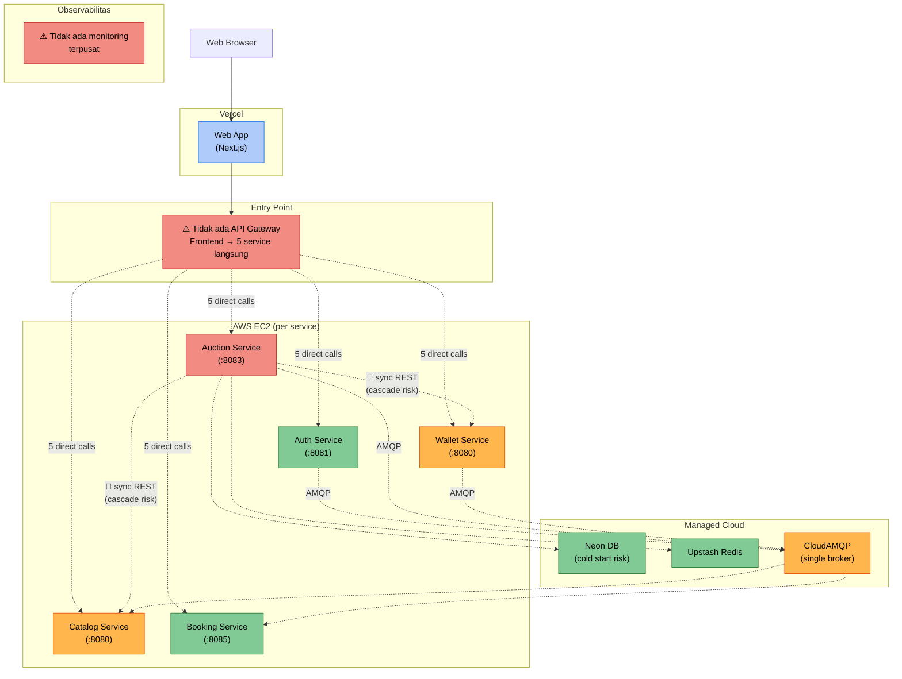

# Tutorial 9B: Visualizing Architecture & Architectural Risk

## Daftar Isi

- [Current Architecture (Commit 1)](#current-architecture)
  - [System Context Diagram](#system-context-diagram)
  - [Container Diagram](#container-diagram)
  - [Deployment Diagram](#deployment-diagram)
- [Future Architecture (Commit 2)](#future-architecture)
- [Risk Storming Explanation (Commit 3)](#risk-storming-explanation)
- [Individual Works (Commit 4)](#individual-works)

## Current Architecture

BidMart adalah platform lelang online berbasis *microservices* yang memungkinkan pengguna untuk menjual dan membeli barang melalui mekanisme lelang. Sistem terdiri dari 5 *microservice* utama yang saling berkomunikasi secara *synchronous* (REST) maupun *asynchronous* (RabbitMQ/AMQP).

### System Context Diagram

Diagram ini menunjukkan gambaran paling abstrak dari sistem BidMart, bagaimana sistem berinteraksi dengan pengguna dan sistem eksternal, tanpa menunjukkan detail teknis internal.

### Container Diagram

Diagram ini menunjukkan seluruh *container* (unit yang dapat dijalankan secara independen) yang menyusun sistem BidMart dan bagaimana mereka berkomunikasi satu sama lain. Pengguna berinteraksi melalui *Frontend Web Application*.

*Catatan: Garis panah dengan label [REST] atau [HTTPS] menandakan komunikasi synchronous, sedangkan [AMQP] menandakan komunikasi asynchronous.*

### Deployment Diagram

Diagram ini menunjukkan di mana dan bagaimana setiap *container* di-*deploy* pada infrastruktur produksi. *Frontend* berjalan secara *serverless* di Vercel, *service* aplikasi berjalan sebagai Docker container di AWS EC2, dan infrastruktur pendukung menggunakan *managed cloud services*.

## Future Architecture

Arsitektur masa depan BidMart ditentukan berdasarkan hasil *risk storming* tim. Tiga perubahan utama yang dilakukan adalah: menambahkan **API Gateway** sebagai *single entry point* agar frontend tidak langsung bergantung ke setiap service, menambahkan **Circuit Breaker** pada jalur sinkron kritis (Auction → Wallet dan Auction → Catalog) untuk mencegah *cascade failure*, dan menambahkan **Monitoring Stack** (Prometheus + Grafana) agar masalah dapat terdeteksi sebelum berdampak ke pengguna.

```mermaid
C4Container
    title Future Architecture Diagram (Post Risk Storming)

    Person(seller, "Seller", "Penjual barang")
    Person(buyer, "Buyer", "Pembeli / Bidder")
    Person(admin, "Admin", "Pengelola operasional platform")

    System_Boundary(bidmart, "BidMart Platform") {

        Container(frontend, "Web Application", "Next.js, React, Tailwind", "Antarmuka utama bagi pengguna")

        Container(gateway, "API Gateway", "Nginx / Kong", "Single entry point: routing, rate limiting, dan JWT validation")

        Container(auth_api, "Auth Service", "Spring Boot 4.0.3", "Registrasi, login, JWT, 2FA")
        ContainerDb(auth_db, "Auth DB", "PostgreSQL 16", "Data user, role & token")

        Container(catalog_api, "Catalog Service", "Spring Boot 3.5.11", "Listing & sinkronisasi harga")
        ContainerDb(catalog_db, "Catalog DB", "PostgreSQL 15", "Data listing & kategori")

        Container(auction_api, "Auction Service", "Spring Boot 3.5.11", "Core lelang & anti-sniping")
        ContainerDb(auction_db, "Auction DB", "Neon DB Serverless", "Data lelang & bid")
        Container(redis, "Distributed Lock", "Upstash Redis", "Locking concurrent bid")
        Container(cb, "Circuit Breaker", "Resilience4j", "Fallback untuk call sinkron Auction → Wallet & Catalog")

        Container(wallet_api, "Wallet Service", "Spring Boot 3.3.2", "Top-up & hold saldo")
        ContainerDb(wallet_db, "Wallet DB", "PostgreSQL", "Data saldo & transaksi")

        Container(booking_api, "Booking Service", "Spring Boot 3.5.x", "Pesanan, notifikasi & sengketa")
        ContainerDb(booking_db, "Booking DB", "PostgreSQL 16", "Data pesanan & shipment")

        Container(mq, "Message Broker", "CloudAMQP RabbitMQ", "Event-driven broker")

        Container(monitoring, "Monitoring Stack", "Prometheus + Grafana", "Scrape metrics tiap service, alert & dashboard")
    }

    Rel(seller, frontend, "Membuat listing & update pengiriman", "HTTPS")
    Rel(buyer, frontend, "Mencari barang, bid, top-up & lacak pesanan", "HTTPS")
    Rel(admin, frontend, "Kelola user, moderasi listing & tangani sengketa", "HTTPS")

    Rel(frontend, gateway, "Semua request API", "REST/HTTPS")

    Rel(gateway, auth_api, "Route auth requests", "REST/JSON")
    Rel(gateway, catalog_api, "Route catalog requests", "REST/JSON")
    Rel(gateway, auction_api, "Route auction requests", "REST/JSON")
    Rel(gateway, wallet_api, "Route wallet requests", "REST/JSON")
    Rel(gateway, booking_api, "Route booking requests", "REST/JSON")

    Rel(auth_api, auth_db, "R/W user data", "SQL/TCP")
    Rel(catalog_api, catalog_db, "R/W listing data", "SQL/TCP")
    Rel(auction_api, auction_db, "R/W auction data", "SQL/TCP")
    Rel(auction_api, redis, "Acquire/release lock", "RESP")
    Rel(wallet_api, wallet_db, "R/W wallet data", "SQL/TCP")
    Rel(booking_api, booking_db, "R/W booking data", "SQL/TCP")

    Rel(auction_api, cb, "Call via circuit breaker", "Internal")
    Rel(cb, wallet_api, "Hold/release saldo (dengan fallback)", "REST [POST]")
    Rel(cb, catalog_api, "Validasi listing (dengan fallback)", "REST [GET]")

    Rel(auth_api, mq, "Publish auth events", "AMQP")
    Rel(auction_api, mq, "Publish auction events", "AMQP")
    Rel(wallet_api, mq, "Publish wallet events", "AMQP")
    Rel(catalog_api, mq, "Consume bid events", "AMQP")
    Rel(booking_api, mq, "Consume closure & bid events", "AMQP")

    Rel(monitoring, auth_api, "Scrape /actuator/prometheus", "HTTP")
    Rel(monitoring, catalog_api, "Scrape /actuator/prometheus", "HTTP")
    Rel(monitoring, auction_api, "Scrape /actuator/prometheus", "HTTP")
    Rel(monitoring, wallet_api, "Scrape /actuator/prometheus", "HTTP")
    Rel(monitoring, booking_api, "Scrape /actuator/prometheus", "HTTP")
```

### Perubahan dari Current ke Future Architecture

| Area | Current | Future | Alasan |
|---|---|---|---|
| Entry point frontend | Frontend memanggil 5 service langsung (5 IP/domain berbeda) | Semua request melalui satu **API Gateway** | Menghilangkan coupling frontend ke IP tiap service; satu titik untuk rate limiting & JWT validation |
| Resiliensi Auction → Wallet/Catalog | Panggilan REST langsung tanpa fallback; jika Wallet/Catalog down, Auction ikut gagal | **Circuit Breaker** (Resilience4j) membungkus call sinkron dan menyediakan fallback response | Mencegah *cascade failure*: Auction tetap bisa merespons meski dependensi sementara hilang |
| Observabilitas | Tidak ada monitoring terpusat; masalah hanya diketahui setelah user laporan | **Prometheus + Grafana** scrape `/actuator/prometheus` semua service; alert otomatis saat error rate / latency naik | Mendeteksi anomali lebih awal sebelum berdampak ke pengguna |

## Risk Storming Explanation

*Risk storming* dilakukan dengan cara masing-masing anggota tim mereview diagram arsitektur *current* secara mandiri, memberi label risiko pada setiap area, lalu mendiskusikan hasilnya bersama untuk mencapai konsensus. Diagram berikut menunjukkan area-area yang diidentifikasi berisiko beserta level risikonya (🔴 Tinggi, 🟠 Sedang, 🟢 Rendah).

### 1. Identification

Tiap anggota tim mereview diagram *current* secara mandiri dan menandai area yang dianggap berisiko. Berikut hasil identifikasi yang digabungkan:

| Area Risiko | Deskripsi Risiko | Impact (1-3) | Likelihood (1-3) | Skor | Level |
|---|---|---|---|---|---|
| Frontend → 5 service langsung (tanpa API Gateway) | Tidak ada rate limiting atau auth centralization; jika IP salah satu service berubah, frontend wajib diubah | 2 | 3 | 6 | 🔴 Tinggi |
| Auction → Wallet REST sinkron | Jika Wallet down atau lambat, proses bid gagal/timeout; tidak ada fallback | 3 | 2 | 6 | 🔴 Tinggi |
| Auction → Catalog REST sinkron | Jika Catalog down saat validasi listing, Auction tidak bisa memproses bid apapun | 3 | 2 | 6 | 🔴 Tinggi |
| Tidak ada monitoring terpusat | Error/degradasi hanya diketahui setelah user komplain; waktu deteksi & penanganan (MTTR) tinggi | 2 | 3 | 6 | 🔴 Tinggi |
| Single EC2 per service (tanpa HA) | Jika satu EC2 down (hardware failure, patching), service tersebut mati total | 3 | 1 | 3 | 🟠 Sedang |
| CloudAMQP sebagai single message broker | Jika CloudAMQP mengalami outage, semua alur event (auth, auction, wallet, booking) berhenti | 2 | 2 | 4 | 🟠 Sedang |
| Neon DB Serverless untuk Auction | Cold start Neon DB menambah latensi pada query pertama setelah periode idle | 1 | 2 | 2 | 🟢 Rendah |

### 2. Consensus

Setelah identifikasi individual, tim berdiskusi untuk menyelaraskan skor dan menentukan prioritas. Beberapa perbedaan pendapat yang muncul:

- **"Frontend → 5 service langsung"** — ada anggota yang menilai *Likelihood* = 2 karena URL service jarang berubah di production. Setelah diskusi, disepakati *Likelihood* = 3 karena tanpa API Gateway tidak ada rate limiting sehingga endpoint service terbuka langsung ke internet, dan dalam skenario scaling atau re-deploy region, IP EC2 bisa berganti.
- **"Single EC2 per service"** — sebagian anggota menilai *Likelihood* = 2. Setelah mempertimbangkan SLA AWS EC2 yang tinggi dan kemampuan restart cepat, disepakati *Likelihood* = 1, namun *Impact* tetap 3 karena jika terjadi maka service benar-benar tidak tersedia.
- **"CloudAMQP single broker"** — awalnya dinilai rendah (skor 2). Setelah diskusi, disepakati sedang (skor 4) karena jika broker mati, seluruh alur async (notifikasi, sinkronisasi harga, penutupan lelang) berhenti sekaligus.

Kesepakatan akhir: fokus mitigasi pada **4 risiko skor tertinggi** (skor 6) karena keempatnya paling actionable dalam scope semester ini tanpa perlu perubahan infrastruktur besar.

### 3. Mitigation

| Risiko | Solusi Mitigasi | Perubahan Arsitektur |
|---|---|---|
| Frontend → 5 service langsung | Tambahkan **API Gateway** (Nginx/Kong) sebagai *reverse proxy* tunggal; frontend hanya butuh satu base URL; gateway yang handle routing, rate limiting, dan JWT validation | Ditambahkan container `API Gateway` antara Frontend dan kelima Backend Service |
| Auction → Wallet REST sinkron (cascade failure) | Bungkus call dengan **Circuit Breaker** (Resilience4j `@CircuitBreaker`); definisikan fallback agar Auction tetap bisa merespons saat Wallet tidak tersedia sementara | Ditambahkan container `Circuit Breaker` antara Auction dan Wallet |
| Auction → Catalog REST sinkron (cascade failure) | Sama seperti di atas — Circuit Breaker membungkus call Auction → Catalog dengan fallback | Circuit Breaker yang sama juga meng-cover call ke Catalog |
| Tidak ada monitoring terpusat | Deploy **Prometheus** untuk scrape `/actuator/prometheus` tiap service + **Grafana** untuk dashboard dan alert rule (error rate > 1% atau p95 latency > 500ms) | Ditambahkan container `Monitoring Stack (Prometheus + Grafana)` dengan relasi scrape ke semua service |

## Individual Works

### Individual Work [Nama] ([NPM])

*[Menambahkan **Component Diagram** dan **Code Diagram** dari container yang dikerjakan.]*
